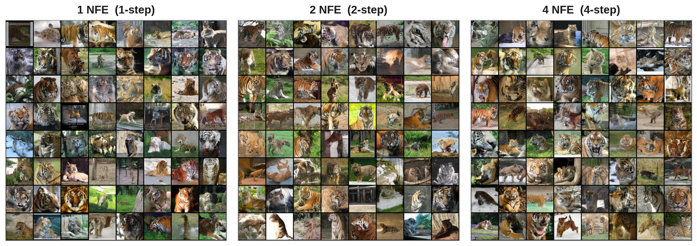
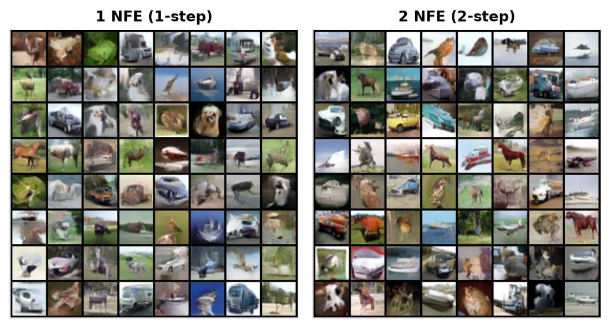
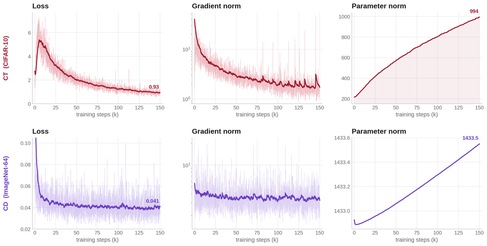

# Unofficial Consistency Models


[](https://arxiv.org/abs/2303.01469)

A from-scratch PyTorch reimplementation of *Consistency Models* (Song et al., 2023), a class of
generative models that produce an image in a single network evaluation with optional few-step
refinement. The repository supports both training routes, consistency distillation (CD) from an EDM
teacher and teacher-free consistency training (CT), and adds two studied extensions: an SNR-adaptive
spectral consistency loss and a consistency-plus-diffusion hybrid sampler.

<p align="center">
  
</p>
<p align="center"><em>Class-conditional ImageNet-64 samples from our CD model at 1 and 2 NFE.</em></p>

## Overview

A diffusion model turns noise into data by integrating a probability-flow ODE, which costs many
network evaluations. A consistency model learns a function that maps any point on a trajectory back to
its clean origin, so generation reduces to a single evaluation. The boundary condition (the function
is the identity at the smallest noise level) is built into the preconditioning rather than learned;
noise levels follow the Karras schedule. The model is an ADM-style U-Net.

Two ways to train the same function:

- **Consistency Distillation (CD).** Two adjacent points on a trajectory are connected by one Heun
  step of a frozen EDM teacher. The online model is pulled toward an EMA target evaluated at the
  teacher-denoised point.
- **Consistency Training (CT).** No teacher. The two points are built from the same noise sample, an
  unbiased one-sample estimate of the same step. The discretization count is annealed over training.

A separate sampling EMA is kept for generation and is what the samplers load by default. One-step
sampling evaluates the model once; multi-step sampling alternates denoising and re-noising over a
short list of intermediate noise levels.

## Results

All numbers were obtained under a reduced compute budget (150k steps at batch 64 to 256, against the
paper's batch 512 to 2048 over 600k to 800k steps). CIFAR-10 figures are an internal FID measured
against `train[:10k]` with 10k samples, so they are useful as relative comparisons rather than as a
match to the published FID.

| Setting | 1-step FID | 2-step FID |
|---|---|---|
| ImageNet-64 CD, ours (batch 64, 150k) | 8.62 | 5.62 |
| ImageNet-64 CD, paper (batch 2048, 600k) | 6.20 | 4.70 |
| CIFAR-10 CT, ours (internal, batch 256, 150k) | 65.4 | 65.8 |
| CIFAR-10 CT, paper (batch 512, 800k) | 8.70 | 5.83 |

Paper rows are the published 50k-image FID; our CIFAR-10 row is the internal 10k-sample FID described
above, so the two CIFAR-10 rows are not directly comparable.

The spectral consistency loss, applied as a 10k-step fine-tune at weight 0.2, lowers CIFAR-10 FID
across samplers (for example, 2-step from 66.5 to 57.0) and brings the generated power spectrum closest
to the real data. Trained from scratch the same term hurts quality, so it is used as a fine-tune of a
converged model.

<p align="center">
  
</p>
<p align="center">
  
</p>

## Installation

Requires Python 3.11 and [uv](https://docs.astral.sh/uv/).

```bash
curl -LsSf https://astral.sh/uv/install.sh | sh
uv sync
```

`uv sync` creates `.venv` and installs the pinned dependencies from `uv.lock`. Run any command with
`uv run` (no manual activation needed), for example `uv run python -m pytest`. On Linux the torch
wheels come from the CUDA 12.1 index; macOS uses the default CPU/MPS build, which is fine for the test
suite but not for training.

## Data

CIFAR-10:

```bash
uv run python -m cm.data.download --dataset cifar10 --data_dir ./data
```

This unpacks CIFAR-10 into `./data/cifar10/{train,val}/<class>/<idx>.png`.

ImageNet 64x64 follows the EDM convention: download ILSVRC2012, center-crop to square, and resize to
64x64. The loader accepts either `<root>/<class>/.png` or flat files prefixed with the WNID. For
CD, place an EDM teacher checkpoint at the path given by `cd.teacher_ckpt` in the config (for example
`pretrained/edm_imagenet64_ema.pt`); it should be a state dict matching `cm.models.unet.UNetModel`.

## Training

```bash
uv run python -m cm.training.train --config configs/cifar10_ct.yaml    --mode ct
uv run python -m cm.training.train --config configs/cifar10_cd.yaml    --mode cd
uv run python -m cm.training.train --config configs/imagenet64_ct.yaml --mode ct
uv run python -m cm.training.train --config configs/imagenet64_cd.yaml --mode cd
```

Useful flags: `--resume <ckpt>` continues from a checkpoint, `--init_ckpt <ckpt>` warm-starts CT
weights, `--max_steps <n>` overrides the schedule length, and `--lambda_spectral <w>` enables the
spectral loss (or use `configs/cifar10_ct_spectral.yaml`). The target and sampling-EMA models are
synchronized to the online model before training starts.

### Defaults

| | CIFAR-10 CT | CIFAR-10 CD | ImageNet64 CT | ImageNet64 CD |
|---|---|---|---|---|
| Model channels | 128 | 128 | 192 | 192 |
| Channel mult | 1,2,2,2 | 1,2,2,2 | 1,2,3,4 | 1,2,3,4 |
| Res blocks per stage | 4 | 4 | 3 | 3 |
| Attention resolutions | 16, 8 | 16, 8 | 32, 16, 8 | 32, 16, 8 |
| Class-conditional | no | no | yes (1000) | yes (1000) |
| Optimizer | RAdam, wd=0 | RAdam, wd=0 | RAdam, wd=0 | RAdam, wd=0 |
| Learning rate | 4e-4 | 4e-4 | 1e-4 | 8e-6 |
| Batch size | 256 | 256 | 64 | 64 |
| Precision | fp32 | fp32 | fp16 | fp16 |
| Loss | LPIPS | LPIPS | LPIPS | LPIPS |
| Max steps | 150k | 150k | 150k | 150k |

Batch sizes and step counts are reduced from the paper. Edit the YAML to scale up with more compute.
`wandb` logging is wired into the trainer; set `logging.use_wandb: false` to disable.

## Sampling

The architecture is read from the checkpoint when available, otherwise pass the training `--config`.
Samplers load the sampling EMA by default.

One-step:

```bash
uv run python -m cm.sampling.onestep \
  --ckpt checkpoints/cifar10_ct_step150000.pt \
  --config configs/cifar10_ct.yaml \
  --batch_size 64 --out_path sample.png
```

Multi-step (the `--nfe 2` preset uses the paper CIFAR-10 schedule `[0.821]`; `--ts` sets explicit
descending noise levels):

```bash
uv run python -m cm.sampling.multistep \
  --ckpt checkpoints/cifar10_ct_step150000.pt \
  --config configs/cifar10_ct.yaml \
  --nfe 2 --batch_size 64 --out_path sample_nfe2.png
```

For a class-conditional ImageNet-64 model, add `--class_id <id>`. Use `--seed <n>` for reproducible
noise.

## Repository layout

```
cm/
  models/      UNet and EDM/Consistency preconditioning
  diffusion/   Karras sigmas, EMA and discretization schedules, Heun solver
  training/    CD/CT trainers, loss functions, entrypoint
  sampling/    one-step and multi-step samplers
  evaluation/  FID via the reference Inception weights
  data/        dataset, loader, transforms, CIFAR-10 downloader
configs/       per-dataset, per-mode YAML
tests/         shape and numerical sanity tests
```

## References

- Song, Y., Dhariwal, P., Chen, M., Sutskever, I. *Consistency Models*. ICML 2023.
  [arXiv:2303.01469](https://arxiv.org/abs/2303.01469).
  [Official code](https://github.com/openai/consistency_models).
- Karras, T., Aittala, M., Aila, T., Laine, S. *Elucidating the Design Space of Diffusion-Based
  Generative Models*. NeurIPS 2022. [arXiv:2206.00364](https://arxiv.org/abs/2206.00364).
  [Official code](https://github.com/NVlabs/edm).
- Dhariwal, P., Nichol, A. *Diffusion Models Beat GANs on Image Synthesis*. NeurIPS 2021.
  [arXiv:2105.05233](https://arxiv.org/abs/2105.05233).

## Citation

```bibtex
@inproceedings{song2023consistency,
  title     = {Consistency Models},
  author    = {Song, Yang and Dhariwal, Prafulla and Chen, Mark and Sutskever, Ilya},
  booktitle = {International Conference on Machine Learning (ICML)},
  year      = {2023}
}
```

## Acknowledgements

This is an unofficial reimplementation for study purposes. The architecture and preconditioning follow
EDM, and the FID path uses the reference Inception weights. It is not affiliated with the original
authors.
